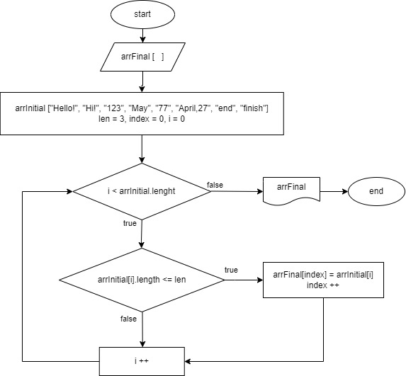

# Итоговая проверочная работа

## Задача:

__*Написать программу, которая из имеющегося массива строк формирует массив из строк, длина которых меньше либо равна 3 символа. Первоначальный массив можно ввести с клавиатуры, либо задать на старте выполнения алгоритма. При решении не рекомендуется пользоваться коллекциями, лучше обойтись исключительно массивами.*__

## Алгоритм выполнения:

1. Создать репозиторий на GitHub
2. Нарисовать блок-схему алгоритма (можно обойтись блок-схемой основной содержательной части, выделив ее в отдельный метод)
3. Снабдить репозиторий оформленным текстовым описанием решения (файл README.md)
4. Написать программу, решающую поставленную задачу
5. Использовать контроль версий в работе над этим небольшим проектом (не должно быть так, что все залито одним коммитом, как минимум этапы 2, 3 и 4 должны быть расположены в разных коммитах)

### 2. Блок-схема алгоритма решения задачи

### 3. Описание решения

Объявляются два массива: исходный и финальный такой же длины. Затем описывается метод, в котором запускается цикл соразмерный длине массива, внутри цикла осуществляется проверка условия (длина элемента исходного массива <=3), если да элемент первого массива заносится в index элемент второго массива. После занесения элемента, удовлетворяющего условию в финальный массив, index увеличивается на 1, переменная i также увеличивается на 1. И так проверяется до конца цикла.

### 4. Программа

Программа, решающая поставленную задачу находится в папке Task.
